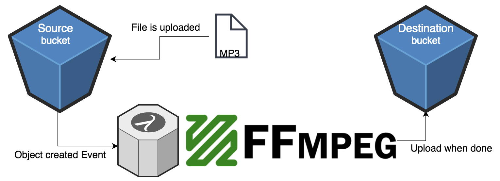

# ⚡ serverless-ffmpeg

[](https://travis-ci.org/kvaggelakos/serverless-ffmpeg)

Bucket event driven FFMPEG built with cloud functions

[](./architecture.png)

## A demo of deploying and using

[](https://asciinema.org/a/154418)


## Getting Started

See deployment for notes on how to deploy to AWS.

### Prerequisites

1. Make sure you're aws keys are set up in `~/.aws/credentials`
2. Make sure you have serveless installed.

```
npm install -g serverless
```

3. Also don't forget to:

```
npm install
```

## Running the tests

To run the tests simply run

```
npm run test
```

## Deployment

In order to run create the stack in AWS run:

```
npm run stack-create
```

## Tear down

To clean up run:

⚠️ !This will remove all contents of your buckets as well! ⚠️

```
npm run stack-destroy
```


## Built With

* [Serverless](https://github.com/serverless/serverless) - The Serverless Framework
* [Webpack](https://github.com/webpack/webpack) - A bundler for javascript and friends
* [FFMPEG](https://github.com/FFmpeg/FFmpeg) - A collection of libraries and tools to process multimedia content such as audio, video, subtitles and related metadata.

## Contributing

All contributions are welcome. Make a pull request wiihooo 🤠

## Authors

* **Kostas Vaggelakos**

## License

This project is licensed under the MIT License - see the [LICENSE.md](LICENSE.md) file for details

## Acknowledgments

* This project is heavily inspired from [aws-lambda-fmpeg](https://github.com/binoculars/aws-lambda-ffmpeg)
